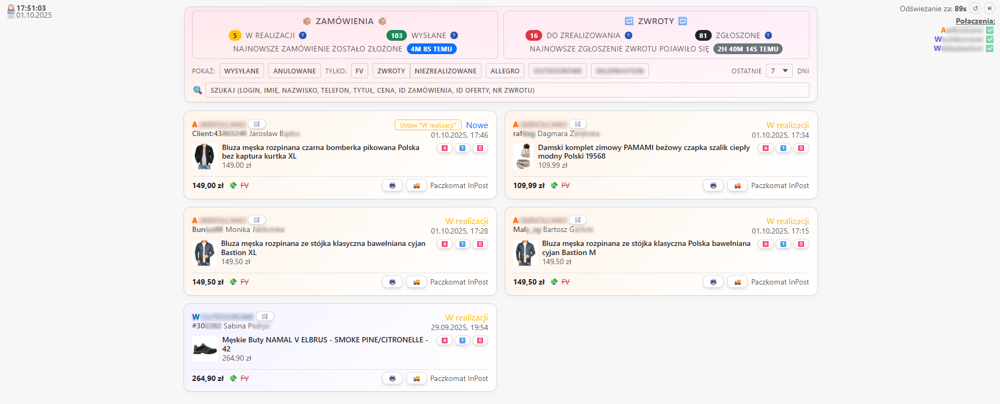

<div align="center">

# 🛒 Simple Allegro Dashboard
Prosty panel interakcyjny do zamówień Allegro + dwóch sklepów WooCommerce: React + Vite + TS (frontend) oraz Express (backend).

</div>

<p align="center">
  
</p>

## Funkcje
| | Funkcja | Notatka |
|---|--------|---------|
| 🔐 | OAuth2 Allegro | Sesja Express, jedno konto |
| 📦 | Zamówienia Allegro | Widgety zamówień z najistotniejszymi danymi |
| 🛍 | WooCommerce x2 | Widgety takie jak z Allegro (bez niektórych funkcji) |
| 🔁 | Zwroty (tylko Allegro) | Dodatkowe informacje w widgetach tj: nr zwrotu, data zwrotu, akcje zwrotu wpłaty i prowizji |
| 👤 | Dane kupującego | Login, imię/nazwisko, adres, faktura, telefon, notatki |
| 🔎 | Wyszukiwarka | Styl Ctrl+F: ID, login, imię, telefon, tytuły, ID ofert, nr zwrotu, kwoty, suma |
| ⚡ | Wydajność | Cache ofert (6h), chunk 20, równoległe load, stale‑while‑revalidate Woo |

> (SCREENSHOT 2: Panel filtrów + wyszukiwarka – `docs/screenshot-filters.png`)

> (SCREENSHOT 3: Karta zamówienia Allegro ze zwrotem – `docs/screenshot-return.png`)

## Architektura
```
frontend/
  App.tsx          – ładowanie + filtry + merge źródeł
  apiAllegro.ts    – pobranie zamówień, danych klienta i faktur z Allegro → Order
  apiWoo.ts        – pobranie zamówień, danych klienta i faktur z WooCommerce → Order
  components/UnifiedOrders.tsx – lista + akcje (refund/prowizja)

server/
  index.js    – endpoints Allegro + zwroty + narzędzia
  allegro.js  – OAuth flow
  woo.js      – proxy Woo (status, verify, orders, notes)

scripts/
  start-hidden.vbs – szybki start aplikacji w tle (Windows, bez okna)
  stop-hidden.vbs  – szybkie zatrzymanie aplikacji
```

> (SCREENSHOT 4: Akcje refund/prowizja na karcie – `docs/screenshot-actions.png`)

## Setup (dev)
```bash
git clone https://github.com/kkkejkus/simple-allegro.git
cd simple-allegro
npm install
cd server && npm install && cd ..
```
Utwórz `server/.env`:
```
ALLEGRO_API_URL=https://api.allegro.pl
ALLEGRO_CLIENT_ID=XXX
ALLEGRO_CLIENT_SECRET=XXX
ALLEGRO_REDIRECT_URI=http://localhost:3001/auth/callback
OFFER_CACHE_TTL_MS=21600000
ALLEGRO_REQ_TIMEOUT_MS=4000
VERBOSE_LOGS=0
```
Uruchom:
```bash
cd server && node index.js   # backend
npm run dev                  # frontend (drugi terminal)
```
Wejdź: http://localhost:5173 i kliknij przycisk 'Zaloguj'.

> (SCREENSHOT 5: Widok Woo zamówień – `docs/screenshot-woo.png`)

## Zmienne środowiskowe
| Nazwa | Opis | Domyślne / Przykład |
|-------|------|---------------------|
| ALLEGRO_API_URL | Bazowy URL API | https://api.allegro.pl |
| ALLEGRO_CLIENT_ID | ID aplikacji Allegro | (własne) |
| ALLEGRO_CLIENT_SECRET | Sekret aplikacji | (własne) |
| ALLEGRO_REDIRECT_URI | Callback OAuth | http://localhost:3001/auth/callback |
| OFFER_CACHE_TTL_MS | TTL cache ofert (ms) | 21600000 |
| ALLEGRO_REQ_TIMEOUT_MS | Timeout request (ms) | 4000 |
| VERBOSE_LOGS | Więcej logów (1/0) | 0 |

## Wydajność
- Cache ofert (Map + TTL 6h)
- Równoległe pierwsze ładowanie (Promise.all)
- Chunk 20 dla pobierania ofert
- Stare Woo dane utrzymane do czasu nowych (stale‑while‑revalidate)

## Drukowanie paragonu / faktury
- W kartach zamówień dostępny przycisk generowania paragonu / faktury (logika pobrania danych, mapowania pozycji oraz format wydruku).
- Szczegółowy mechanizm (format dokumentu, integracja z drukarką / PDF, normalizacja stawek VAT) jest opisany w osobnym repozytorium: **"Allegro/Wordpress Essentials"**.
- Ten projekt zawiera jedynie wywołanie / hook do procedury generującej – pełna dokumentacja i ewentualne zależności pomocnicze znajdują się we wspomnianym repo.

## Licencja
Ten projekt NIE POSIADA obecnie formalnej licencji open‑source. Został stworzony wyłącznie w celach edukacyjnych oraz do użytku własnego autora – jako narzędzie do pogłębiania wiedzy i optymalizacji procesu obsługi zamówień.

Zasady / intencje:
- Możesz przeglądać kod i lokalnie go uruchamiać w celach nauki / eksperymentów.
- Możesz tworzyć prywatne forki / modyfikacje dla własnych potrzeb.
- Ulepszanie (refaktoryzacje, dodawanie funkcji) jest mile widziane w formie PR – o ile nie narusza powyższych założeń.
- Publiczne dalsze rozpowszechnianie, komercyjna eksploatacja lub kopiowanie fragmentów do innych publicznych projektów wymaga wcześniejszej zgody autora.
- Kod dostarczony jest „AS IS” – bez jakichkolwiek gwarancji lub odpowiedzialności za skutki użycia.
